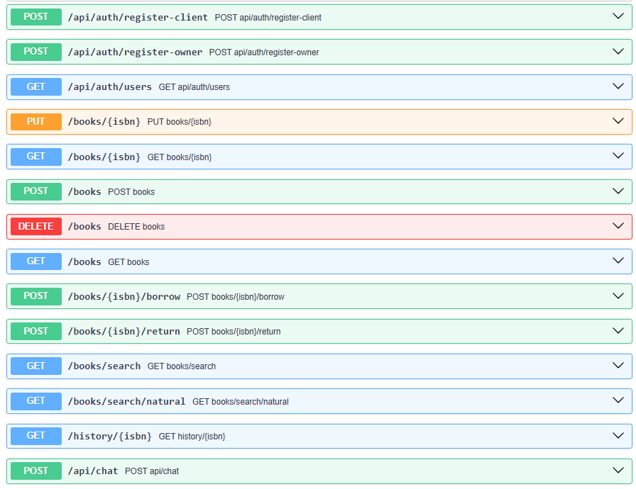

# Library Management System

A modern Spring Boot 3.x / Java 25 application designed to manage a library management system.

Available Features:

User Roles

- Client: Can view available books and borrow them.
- Owner: Can add, remove, or update books in the inventory.

Core Functionalities

- View Books: Both roles can view and search the list of books.
- Borrow Book: Clients can borrow a book if it is available.
- Return Book: Clients can return a book.
- Manage Books: Owners can add, update, or remove books.
- Book History: Track who borrowed a book, when it was returned, and whether it was returned late.
- Authentication: Distinguish between client and owner roles.
- Use of Testcontainers with JUnit for integration testing.
- Natural language search.
- Integrate with an MCP server to expose the system to AI agents.
- Chat assistant API.

Endpoints



- If you would like to see the Open API specification in more detail, copy the content of the "openapi.yml" file and
  paste into https://editor.swagger.io.

---

## Quick Start (Docker Compose)

The entire environment—including the Java application database structures, local Ollama instance, and automated model
provisioning—is fully containerized. You do not need Java, Maven, or Ollama installed on your host machine.

### Prerequisites

* [Docker Desktop](https://www.docker.com/products/docker-desktop/) installed and running.

### Spin Up the Application

1. Open your terminal in the project root directory.
2. Run the following command:
   ```bash
   docker compose up --build
3. The first build can take a while, so be patient :).
4. Head over to http://localhost:8080/swagger-ui/index.html#/ or import the Postman collection called
   VestasLibraryManagementSystem.postman_collection into your local Postman and start using right away.
   If you use Postman, remember to change the base_url to http://localhost:8080, and the other variables as you wish.
   Be aware that request related to AI can take a little while and sometimes return wrong responses (if that happens
   send another request).
5. Keep in mind that there is role-based authentication.
   The credentials for the base roles are (owner / owner123) and
   (client / client123), but the API allows to create new users if you intend to.
6. Any doubt email me at rodrigoleitecorreia1@gmail.com or call (+351) 928 059 611.
